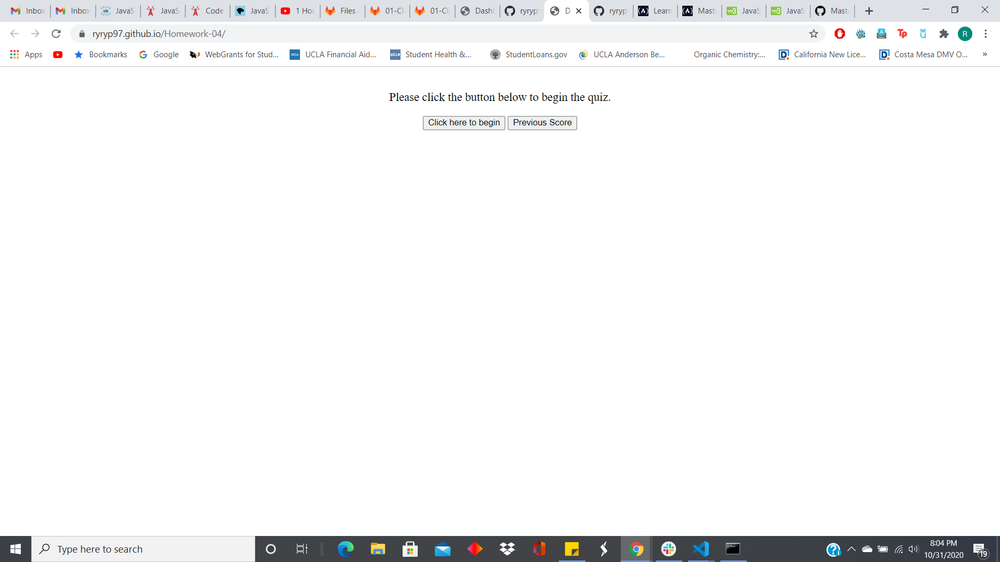
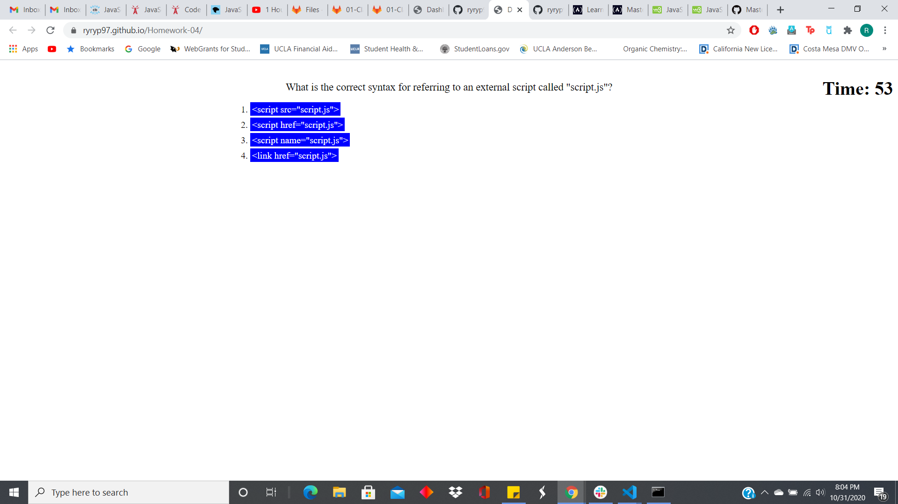

# Coding-Quiz

This repository contains a program that is a coding quiz, specifically on javascript.  It was created in order to practice coding JavaScript algorithms and DOM manipulation.

The site can be reached here: [Code Quiz](https://ryryp97.github.io/Homework-04/)

This is what the coding quiz looks like:

### Usage

To navigate through the quiz, click on the start quiz button, this will reveal the first question and a timer in the corner.  In order to reveal the next question you must click on one of the answers.  If you clicked on the right answer your score will go up, however, if the wrong answer is clicked then time will be subtracted from the timer.  Once, the timer reaches 0 or all the questions are answers your score will be alerted and you will be prompted to enter your intitals.  These values will be stored in LocalStorage and can be retrieved by clicking on the previous scores button.

### Credits

I'd like to thank W3Schools and many threads on Stack Overflow for their help in the creation of this website.

### License 

MIT License

Copyright (c) 2020 Ryan Petrecca

Permission is hereby granted, free of charge, to any person obtaining a copy of this software and associated documentation files (the "Software"), to deal in the Software without restriction, including without limitation the rights to use, copy, modify, merge, publish, distribute, sublicense, and/or sell copies of the Software, and to permit persons to whom the Software is furnished to do so, subject to the following conditions:

The above copyright notice and this permission notice shall be included in all copies or substantial portions of the Software.

THE SOFTWARE IS PROVIDED "AS IS", WITHOUT WARRANTY OF ANY KIND, EXPRESS OR IMPLIED, INCLUDING BUT NOT LIMITED TO THE WARRANTIES OF MERCHANTABILITY, FITNESS FOR A PARTICULAR PURPOSE AND NONINFRINGEMENT. IN NO EVENT SHALL THE AUTHORS OR COPYRIGHT HOLDERS BE LIABLE FOR ANY CLAIM, DAMAGES OR OTHER LIABILITY, WHETHER IN AN ACTION OF CONTRACT, TORT OR OTHERWISE, ARISING FROM, OUT OF OR IN CONNECTION WITH THE SOFTWARE OR THE USE OR OTHER DEALINGS IN THE SOFTWARE.
